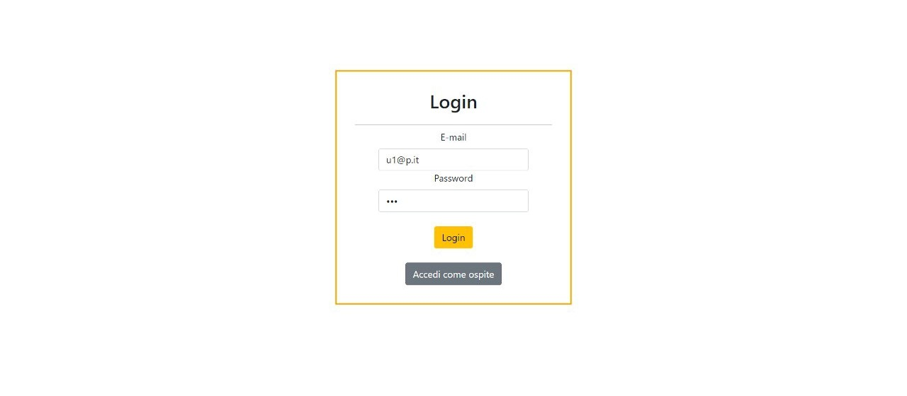
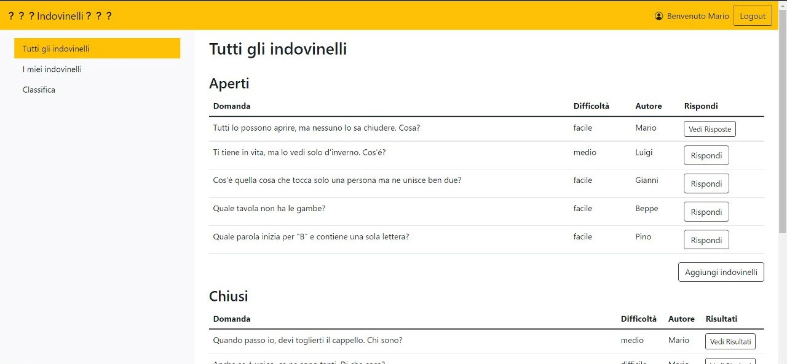
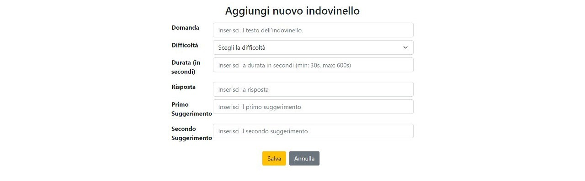
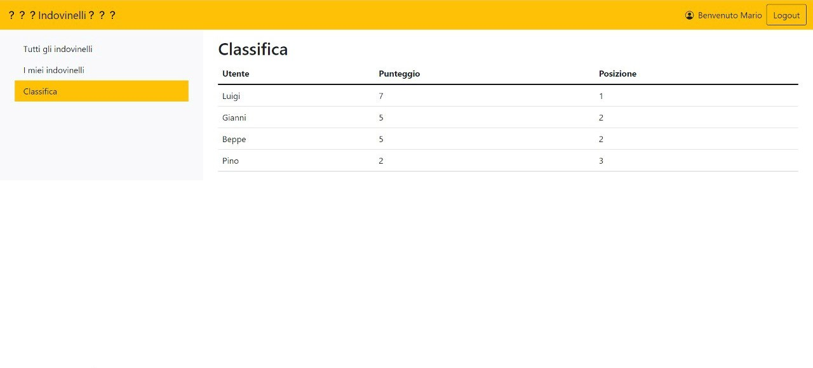
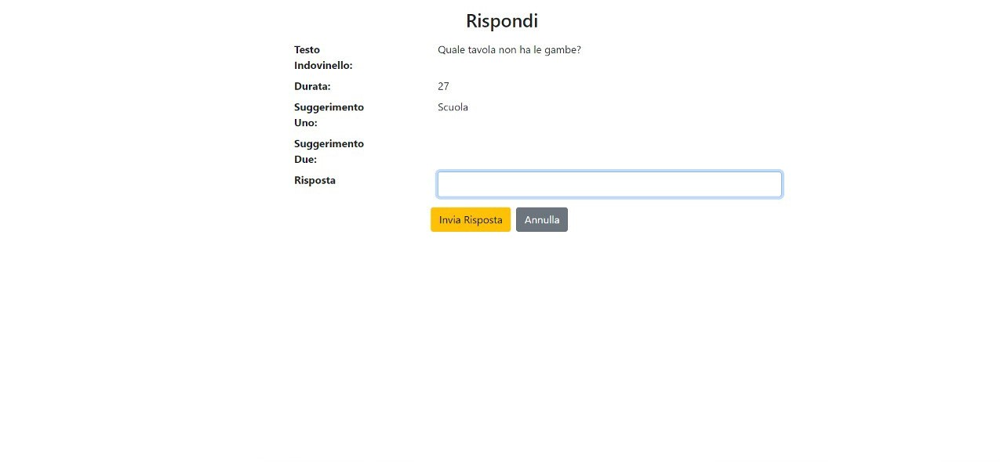

# Exam #2: "Indovinelli"
## Student: s296492 SCICOLONE OMAR 

## React Client Application Routes

## Screenshot

- Route `/`: porta alla pagina principale attraverso la quale si accede a tutte le funzionalità dell'applicazione. Nel caso non si fosse loggati, la route riporterà alla route /login.
- Route `/filter/:activeFilter`: porta alla pagina principale specificando cosa deve essere visualizzato (tutti gli indovinelli, gli indovinelli dell'utente loggato, la classifica) grazie al parametro "active filter". Nel caso non si fosse loggati, la route riporterà alla route /login.
- Route `/anonimo`: porta alla pagina principale adattata per la visualizzazione da parte di utente non loggato (ospite)
- Route `/anonimo/filter/:activeFilter`: porta alla pagina principale (per utente anonimo) e permette di specificare cosa visualizzare (tutti gli indovinelli, classifica)
- Route `/login`: porta alla pagina di login attraverso il quale si può accedere all'applicazione con le proprie credenziali oppure come ospite. 
- Route `/add`: porta alla pagina dedicata all'aggiunta di un indovinello. Nel caso non si fosse loggati, la route riporterà alla route /login.
- Route `/risposta/:indovinelloId`: porta alla pagina dedicata alla risposta ad un indovinello. Il parametro "indovinelloId" serve per specificare a quale indovinello stiamo rispondendo. Nel caso non si fosse loggati, la route riporterà alla route /login.
- Route `/risposte/:indovinelloId`: porta alla pagina dedicata alla visualizzazione delle risposte di un indovinello. Il parametro "indovinelloId" serve per specificare di quale indovinello vogliamo visualizzare le risposte. Nel caso non si fosse loggati, la route riporterà alla route /login.
- Route `/risultati/:indovinelloId`: porta alla pagina dedicata alla visualizzazione dei risultati di un indovinello. Il parametro "indovinelloId" serve per specificare di quale indovinello vogliamo visualizzare i risultati. Nel caso non si fosse loggati, la route riporterà alla route /login.

## API Server

- POST `/api/sessions`
  - nessun parametro richiesto.
  - username e password.
- DELETE `/api/sessions/current`
  - nessun parametro richiesto.
  - nessun body di risposta.
- GET `/api/sessions/current`
  - nessun parametro richiesto.
  - come body di risposta: informazioni su utente utente loggato
- GET `/api/indovinello/nuovoId`
  - nessun parametro richiesto.
  - come body di risposta: numero dell'id del nuovo indovinello.
- GET `/api/indovinello/timestamp/:idIndovinello`
  - come parametro: è richiesto id dell'indovinello di cui si vuole sapere il timestamp.
  - come body di risposta: "timestamp": null oppure "timestamp": "2022-07-14T16:40:12.293Z" (data di esempio).
- GET `/api/risposte/:idIndovinello`
  - come parametro: è richiesto id dell'indovinello di cui si le risposte.
  - elenco delle risposte a quell'indovinello.
- GET `/api/indovinelli/filter/:filter`
  - come parametro: il filtro con il quale specificare cosa ricevere (tutti gli indovinelli, i miei indovinelli, classifica).
  - come body di risposta: o tutti gli indovinelli, o gli indovinelli dell'utente loggato, o la classifica degli utenti in base al punteggio.
- GET `/api/anonimo/indovinelli/filter/:filter`
  - come parametro: il filtro con il quale specificare cosa ricevere (tutti gli indovinelli, classifica).
  - come body di risposta: o tutti gli indovinelli o la classifica degli utenti in base al punteggio.
- POST `/api/add`
  - come body da inviare: tutte le informazioni relative al nuovo indovinello (domanda, stato, difficoltà, durata, risposta, suggerimento 1 e 2).
  - nessun body di risposta.
- POST `/api/risposta/:indovinelloId`
  - come parametro: è richiesto l'id dell'indovinello a cui rispondere. Come body: è richiesto il testo della risposta.
  - nessun body di risposta.
- PUT `/api/indovinello/:indovinelloId`
  - come parametro: è richiesto l'id dell'indovinello a cui aggiornare il timestamp. Come body: è richiesto il timestamp da impostare nell'indovinello.
  - nessun body di risposta.
- PUT `/api/indovinello/stato/:indovinelloId`
  - come parametro: è richiesto l'id dell'indovinello a cui aggiornare lo stato. Come body: è richiesto lo stato da impostare nell'indovinello.
  - nessun body di risposta.
- GET `/api/users`
  - nessun parametro richiesto.
  - lista di tutti gli utenti.
- PUT `/api/user/punteggio/:punteggio`
  - come parametro: è richiesto il valore del punteggio da impostare all'utente loggato. Nessun body richiesto.
  - nessun body di risposta.

## Database Tables

- Tabella `indovinelli` - contiene: -id(chiave primaria) -stato -domanda -difficoltà -durata -risposta -suggerimentoUno -suggerimentoDue -user -timestamp. Serve per memorizzare tutte le informazioni relative agli indovinelli presenti e aggiunti nel db.
- Tabella `risposte` - contiene: -id(chiave primaria) -idIndovinello -idUser -risposta. Serve per memorizzare tutte le informazioni relative alle risposte presenti e aggiunte nel db.
- Tabella `users` - contiene: -id(chiave primaria) -email -nome -password -salt -punteggio. Serve per memorizzare tutte le informazioni relative agli utenti presenti nel db. 
- Tabella `sqlite_sequence` - contiene: -name -seq. Tabella generata automaticamente per gestire i valori con autoincremento

## Main React Components

- `MyMain` (in `Main.js`): il componente principale da cui viene visualizzata l'intera pagina principale (la sidebar, la navbar e la tabella degli indovinelli/classifica)
- `FormIndovinello` (in `FormIndovinello.js`): componente che visualizza un form per l'aggiunta degli indovinelli nel database
- `VisualizzaRisposte` (in `VisualizzaRisposte.js`): componente che visualizza la lista delle risposte date ad un indovinello
- `FormIndovinello` (in `FormIndovinello.js`): componente che visualizza un form per l'aggiunta di una risposta ad un indovinello
- `LoginForm` (in `LoginComponents.js`): componente che visualizza un form effettuare il login
- `VisualizzaRisultati` (in `VisualizzaRisultati.js`): componente che visualizza la lista delle risposte date ad un indovinello chiuso, la risposta corretta
- `MySideBar` (in `Sidebar.js`): componente che visualizza la sidebar che permette di selezionare cosa visualizzare (tutti gli indovinelli, i miei indovinelli, clasifica)
- `MyNavBar` (in `Navbar.js`): componente che visualizza la navbar da cui è possibile fare il logout

(only _main_ components, minor ones may be skipped)

## Users Credentials

- username: u1@p.it, password: psw
- username: u2@p.it, password: psw
- username: u3@p.it, password: psw
- username: u4@p.it, password: psw
- username: u5@p.it, password: psw